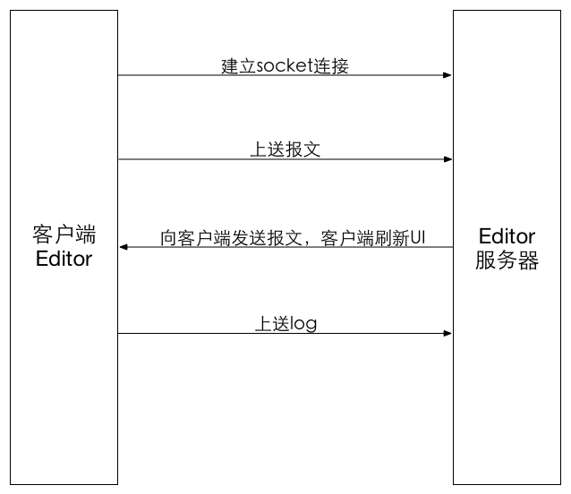
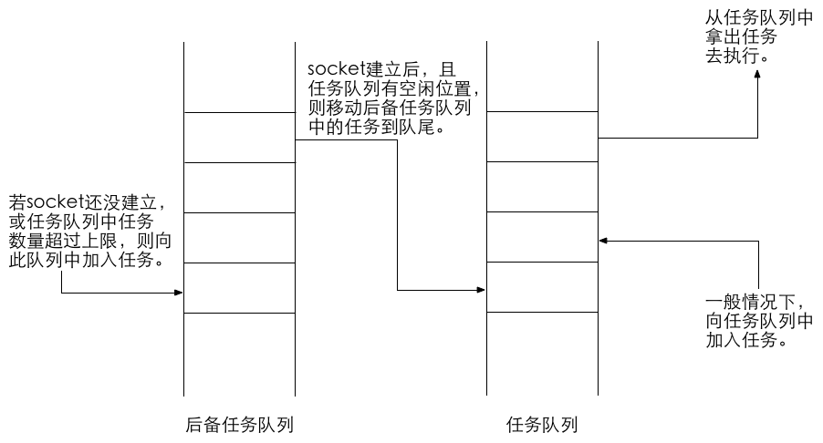

# EMP Editor 实现思路 #

## 版本历史

版本号|日期|作者|描述
---|---|---|---
V1.0|2015.5.29|李浩(li.hao85)|整体实现原理描述
V1.1|2015.7.18|李浩(li.hao85)|增加新的上送报文与接收报文协议、新的日志上送协议
V1.2|2015.7.22|李浩(li.hao85)|安卓的任务队列机制移到文章最后、增加对新旧两种报文解析协议的兼容性说明、对新增的外联css如何处理进行了说明

<!-- toc -->

## 整体流程 ##

### 整体功能图示 ###



整个editor客户端部分包括如下的三个功能：

- 上送报文给editor服务器，用于显示。
- 从editor服务器接收报文，用于页面刷新(教程部分的功能其实和这里是一样的)。
- 上送log日志给editor服务器，用于显示。

说明：

- 客户端上送给Editor服务器的报文包括静态页面、外联样式及外联脚本。
- Editor服务器发送给客户端的报文也包括静态页面、外联样式及外联脚本，到客户端会拼接成完整的报文来刷新UI。
- 上送log日志用的是Android自带的控制台监听功能。

## 各个功能模块 ##

### 建立socket连接 ###

使用如下的一些基本信息socket连接，并标记socket连接长期存在(如：使用setKeepAlive(true)语句)：

- Editor服务器地址。
- Editor服务器端口号。
- 是否采用新的报文解析协议。(可以用一个boolean值来确定，用于兼容老的Editor功能。目前Editor调试工具会保留新旧两种报文解析协议，使用老的Editor调试工具的项目可以配置这个开关为false。)

如果没有建立连接，则弹框提示用户是否重连。当用户选择重连后，尝试新一轮的连接；当用户不再重新连接后，结束editor调试。

如果连接建立成功，则会保持这个连接，并做如下两件事：

- 等待客户端主动上送报文到editor服务器。
- 等待服务器传给客户端新的报文。

以上的“等待”任务是通过开了不同的线程来实现的，不会导致UI卡死。

### 向Editor服务器发送报文 ###

前提：与Editor服务器的socket连接已经建立。

客户端获得报文后，除了供框架自己解析用之外，还要将报文上传给Editor服务器一份，用于展示。

如果是从Editor服务器获得的返还报文(下一节描述的情况)，那么这段报文会带有一个donotsend的标记，有这个标记的话，就不必再次向Editor服务器发送报文了。

正常的话是从EWP服务器获得的报文，这种报文不带有donotsend标记，需要上送给Editor服务器。

上送报文内容：

- 静态页面。
- 外联的Lua脚本，需要上传文件名字和内容，可能有多个。
- 外联的样式，需要上传文件名字和内容，可能有多个。

上送报文格式【客户端->服务端】：

旧的报文传输协议见《数据传输协议old》，新的传输协议见《数据传输协议new》。

### 从Editor服务器接收修改的报文 ###

前提：与Editor服务器的socket连接已经建立。

socket连接建立后，会等待Editor服务器传送过来的报文，把这个报文加上donotsend标记，交给框架去解析。加上donotsend标记后，就不会再次上传这段报文了。

客户端的框架先去掉这个donotsend标记，再解析这个报文，把它转化成能够解析的格式，之后进行客户端的UI刷新。解析的内容有：

- Editor服务器传回的静态页面。
- Editor服务器传回的外联Lua脚本，包括名字和内容，可能有多个。
- Editor服务器传回的外联样式文件，包括名字和内容，可能有多个。

解析Editor报文格式【服务端->客户端】：

旧的报文传输协议见《数据传输协议old》，新的传输协议见《数据传输协议new》。

### 用修改后的报文刷新客户端UI ###

时机：上一部分中客户端获取了报文、外联样式和外联脚本后，用replace接口刷新。

刷新之前需要进行如下的工作：

- Editor服务器传回的报文中含有外联Lua脚本，用这个新的外联Lua脚本替换静态页面中已有的同文件名的脚本。如果没有同名的外联脚本，则新的外联脚本作为附加的内容被解析。
- Editor服务器传回的报文中含有外联的css样式，处理方法同上，也是采取替换同名文件的做法。如果没有同名的样式文件，则新的样式文件作为附加内容被解析。

### 上送日志 ###

前提：与Editor服务器的socket连接已经建立。

上送日志另开了一个线程，随时上送Android的控制台信息。不过控制台信息过多，需要过滤，过滤的字符串为：(此处由于5.2框架采取Log.i的方式打印日志，因此更新了过滤器的写法)

```
logcat -s System.out *:I
```

上送日志的格式【客户端->服务端】：

旧的报文传输协议见《数据传输协议old》，新的传输协议见《数据传输协议new》。

## 其他 ##

### 任务队列机制 ###

这个机制移植自安卓5.2，并在此基础上加入了一个后备队列，图示如下：



加入后备队列的原因是：

- 某些页面在没有和Editor服务器建立连接的时候就需要上送报文，如ip.xml。
- 不同机器上运行Editor服务器的情况并不相同，有的机器性能不高，上送的任务过多，不能即时处理，此处先利用后备任务队列暂存过剩的任务，待正式的任务队列有了空闲后再去执行后备任务。

注：执行后备任务的时候，是将后备队列上的任务全部执行完，再去执行正式任务队列上的任务。如果此时还有新任务加入，则新任务要被加入到后备队列上。整个过程直到后备队列上的任务都被放到任务队列上且执行完毕，才算结束。

不要求所有平台都实现此功能。

