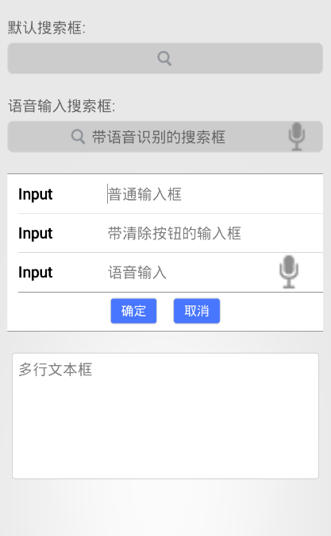
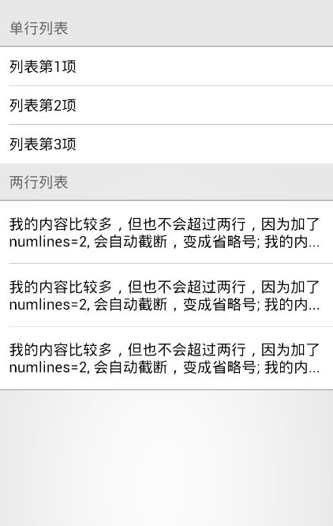
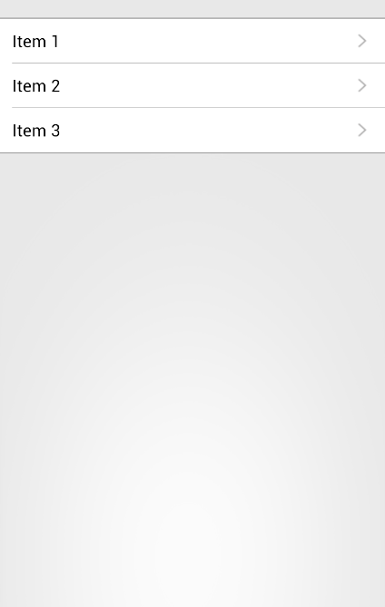
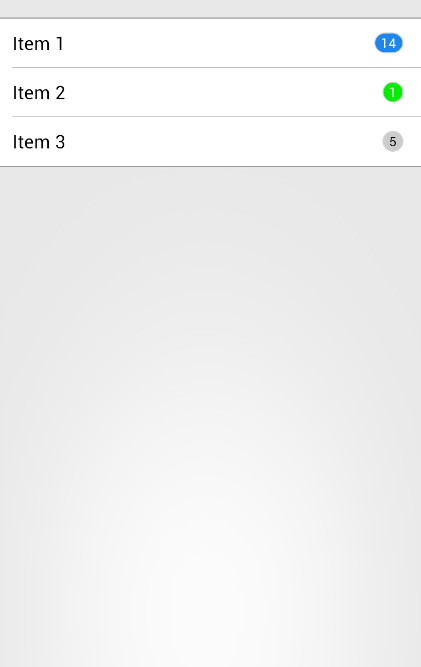
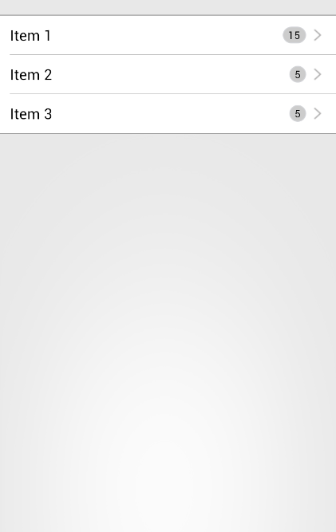
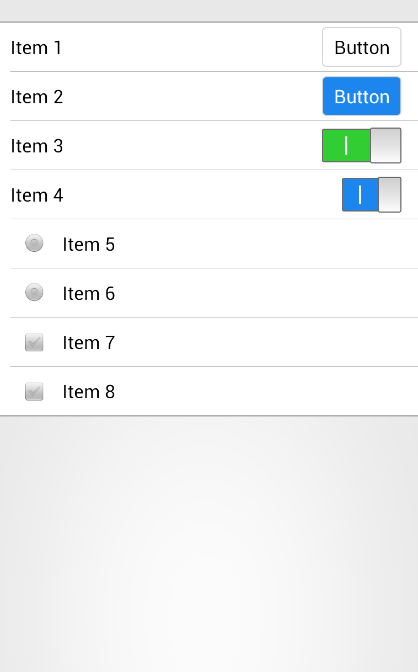
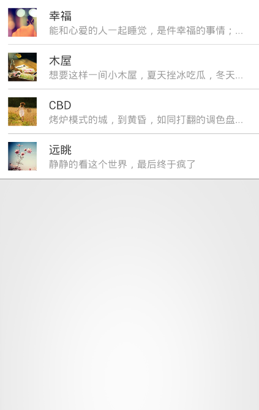
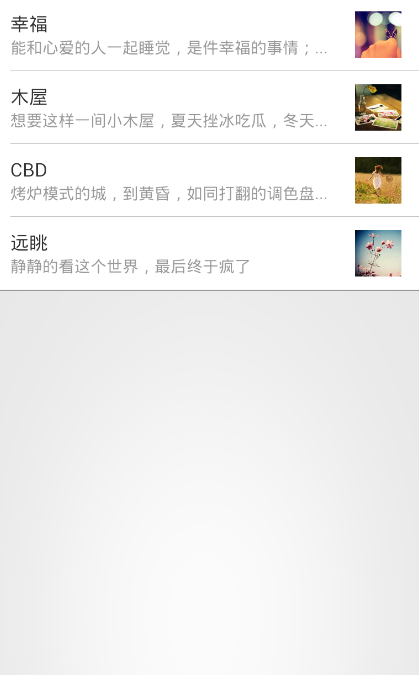
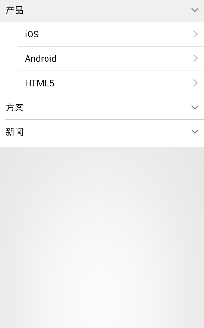

# ERT基础控件库

## 输入框

CSS代码片段：
```
<style>
    .ert_content_padded {left: 0px;width: 320px;top: 20px;}
    .ert_label_search {left: 10px;font-size: 14px;color: #666666;}
    .ert_div_search {left: 10px;width:300px;height:30px;border-radius: 5px;background-color: #CCCCCC;}
    .ert_input_clear {left: 25px;width: 270px;height: 30px;font-size: 14px;background-color: #CCCCCC;}
    .ert_img_search {height: 15px;width: 15px;}
    .ert_img_search_pos1 {top: 8px;left: 142px;}
    .ert_img_search_pos2 {top: 8px;left: 60px;}
    .ert_label_speech {top: 0px; left: 80px;height: 30px;font-size: 14px; color: #666666;}
    .ert_div_mul_inputs {left: 10px;width: 300px;background-color: #FFFFFF;}
    .ert_line {left: 0px;width: 300px; height: 1px;background-color: #999999;}
    .ert_line_div_top {top: 0px;width: 300px;}
    .ert_line_table_bottom {left: 10px;top: 112px;width: 290px;}
    .ert_line_div_bottom {top: 149px;width: 300px;}
    .ert_tbl_mul_inputs {left: 10px;top:1px;width: 290px;}
    .ert_tr_mul_inputs {height: 37px;}
    .ert_td1_mul_inputs {width: 80px;}
    .ert_td2_mul_inputs {width: 210px;}
    .ert_td1_lbl {font-size: 14px;font-weight: bold;}
    .ert_input_td2 {font-size: 14px;height: 35px;width: 200px;}
    .ert_div_btn {height:37px;width: 300px;left: 0px;top:112px;}
    .ert_button_mul_inputs {width: 45px;height: 25px;border-radius: 3px;font-size: 12px; background-color: #4876FF;color: #FFFFFF;}
    .ert_div_width_5 {width: 5px;height: 25px;inline-block:inline;}
    .ert_textarea {left: 14px; width: 292px;height: 120px;font-size: 14px;background-color: #FFFFFF;}
</style>
```

lua脚本代码片段：
```
<script type="text/x-lua">
    <![CDATA[
        --[[改变控件样式]]--
        function changeStyle(name,style,value)
            local ctrl = document:getElementsByName(name);
            if ctrl and #ctrl > 0 then
                for key,ctrl_atom in pairs(ctrl) do
                    ctrl_atom:setStyleByName(style,value);
                end;
            else
                window:alert(name .. "控件不存在 ！");
            end;
        end;

        --[[改变控件属性]]--
        function changeProperty(name,property,value)
            local ctrl = document:getElementsByName(name);
            if ctrl and #ctrl > 0 then
                for key,ctrl_atom in pairs(ctrl) do
                    ctrl_atom:setPropertyByName(property,value);
                end;
            else
                window:alert(name .. "控件不存在 ！");
            end;
        end;

        --[[第一个输入框的onfocus事件]]--
        function set_img_pos()
            changeStyle("ert_img_search","left","8px");
        end

        --[[第一个输入框的onblur事件]]--
        function set_img_back()
            changeStyle("ert_img_search","left","142px");
        end

        --[[第二个输入框的onfocus事件]]--
        function set_img_pos2()
            changeStyle("img_search","left","8px");
            changeProperty("label_speech","text","");
        end

        --[[第二个输入框的onblur事件]]--
        function set_img_back2()
            local ctl_input_speech =document:getElementsByName("input_speech");
            if ctl_input_speech and #ctl_input_speech>0 then
                local speech_value = ctl_input_speech[1]:getPropertyByName("value");
                if speech_value == "" then
                    changeStyle("img_search","left","60px");
                    changeProperty("label_speech","value","带语音识别的搜索框");
                else
                    return;
                end
           end
        end

        --确定按钮
        function confirm()
            window:alert("确定按钮被点击！");
        end

        --取消按钮
        function cancel()
            window:alert("取消按钮被点击！");
        end

    ]]>
</script>
```

页面报文代码片段：
```
<body>
    <div class="ert_content_padded" border="0">
        <label class="ert_label_search">默认搜索框:</label> <br/>
        <div class="ert_div_search" border="1" align="center" valign="middle">
            <input type="text" class="ert_input_clear" border="0" onfocus="set_img_pos()" onblur="set_img_back()" clearMode="editing"/> <br/>
            </img>
        </div>
        <br/>
        <label class="ert_label_search">语音输入搜索框:</label> <br/>
        <div class="ert_div_search" border="1" align="center" valign="middle">
            <input type="text" class="ert_input_clear"  name="input_speech" border="0" clearMode="editing" rightImg="speech.png" rightImgMode="unlessEditing" onfocus="set_img_pos2()" onblur="set_img_back2()"/> <br/>
            </img>
            <label class="ert_label_speech" name="label_speech">带语音识别的搜索框</label>
        </div>
        <br/>
        <div class="ert_div_mul_inputs" border="0" align="center">
            <div class="ert_line,ert_line_div_top" border="0"></div>
            <table class="ert_tbl_mul_inputs" border="0" separator="#999999">
                <tr class="ert_tr_mul_inputs">
                    <td class="ert_td1_mul_inputs">
                        <label class="ert_td1_lbl">Input</label>
                    </td>
                    <td class="ert_td2_mul_inputs">
                        <input type="text" class="ert_input_td2" border="0" hold="普通输入框"/>
                    </td>
                </tr>
                <tr class="ert_tr_mul_inputs">
                    <td class="ert_td1_mul_inputs">
                        <label class="ert_td1_lbl">Input</label>
                    </td>
                    <td class="ert_td2_mul_inputs">
                        <input type="text" class="ert_input_td2" border="0" clearMode="editing" hold="带清除按钮的输入框"/>
                    </td>
                </tr>
                <tr class="ert_tr_mul_inputs">
                    <td class="ert_td1_mul_inputs">
                        <label class="ert_td1_lbl">Input</label>
                    </td>
                    <td class="ert_td2_mul_inputs">
                        <input type="text" class="ert_input_td2" border="0"  clearMode="editing" hold="语音输入" rightImg="speech.png" rightImgMode="unlessEditing"/>
                    </td>
                </tr>
            </table>
            <div class="ert_div_btn" border="0" align="center" valign="middle">
                <input type="button" class="ert_button_mul_inputs" border="1" value="确定" onclick="confirm()"/>
                <div border="0" class="ert_div_width_5"></div>
                <input type="button" class="ert_button_mul_inputs" border="1" value="取消" onclick="cancel()"/>
            </div>
            <div class="ert_line,ert_line_table_bottom" border="0"></div>
            <div class="ert_line,ert_line_div_bottom" border="0"></div>
        </div>
        <br/>
        <textarea class="ert_textarea" hold="多行文本框"></textarea>
    </div>
</body>
```

效果图片：  



## 列表

CSS代码片段：
```
<style>
    .ert_lbl_single_list {left: 10px;top: 20px;height: 25px;font-size: 14px;color: #666666;}
    .ert_div_list {left: 0px;width: 320px;background-color: #FFFFFF;}
    .ert_tbl_list {left: 10px;top: 1px;width: 310px;}
    .ert_tr_single_list {height: 37px;}
    .ert_td_single_list {width: 310px;}
    .ert_table_view_cell {font-size: 14px;}
    .ert_line {left: 0px;width: 320px; height: 1px;background-color: #999999;}
    .ert_line_div_top {top: 0px;}
    .ert_line_div_bottom {bottom: 112px;}
    .ert_lbl_mul_list {left: 10px;height: 25px;font-size: 14px;color: #666666;}
    .ert_tr_mul_list {height: 60px;}
    .ert_line_div_bottom2 {top: 181px;}
</style>
```

页面报文代码片段：
```
<body>
    <label class="ert_lbl_single_list">单行列表</label>
    <div class="ert_div_list" border="0">
        <div class="ert_line,ert_line_div_top" border="0"></div>
        <table class="ert_tbl_list" separator="#999999" border="0">
            <tr class="ert_tr_single_list">
                <td class="ert_td_list">
                    <label class="ert_table_view_cell">列表第1项</label>
                </td>
            </tr>
            <tr class="ert_tr_single_list">
                <td class="ert_td_list">
                    <label class="ert_table_view_cell">列表第2项</label>
                </td>
            </tr>
            <tr class="ert_tr_single_list">
                <td class="ert_td_list">
                    <label class="ert_table_view_cell">列表第3项</label>
                </td>
            </tr>
        </table>
        <div class="ert_line,ert_line_div_bottom" border="0"></div>
    </div>
    <label class="ert_lbl_mul_list">两行列表</label>
    <div class="ert_div_list" border="0">
        <div class="ert_line,ert_line_div_top" border="0"></div>
        <table class="ert_tbl_list" separator="#999999" border="0">
            <tr class="ert_tr_mul_list">
                <td class="ert_td_list">
                    <label class="ert_table_view_cell" numlines="2">我的内容比较多，但也不会超过两行，因为加了numlines=2, 会自动截断，变成省略号; 我的内容比较多，但也不会超过两行，因为加了numlines=2, 会自动截断，变成省略号</label>
                </td>
            </tr>
            <tr class="ert_tr_mul_list">
                <td class="ert_td_list">
                    <label class="ert_table_view_cell" numlines="2">我的内容比较多，但也不会超过两行，因为加了numlines=2, 会自动截断，变成省略号; 我的内容比较多，但也不会超过两行，因为加了numlines=2, 会自动截断，变成省略号</label>
                </td>
            </tr>
            <tr class="ert_tr_mul_list">
                <td class="ert_td_list">
                    <label class="ert_table_view_cell" numlines="2">我的内容比较多，但也不会超过两行，因为加了numlines=2, 会自动截断，变成省略号; 我的内容比较多，但也不会超过两行，因为加了numlines=2, 会自动截断，变成省略号</label>
                </td>
            </tr>
        </table>
        <div class="ert_line,ert_line_div_bottom2" border="0"></div>
    </div>
</body>
```

效果图片：  




## 列表右侧带导航箭头

CSS代码片段：
```
<style>
    .ert_div_navi_list {top:20px;left: 0px;width: 320px;background-color: #FFFFFF;}
    .ert_tbl_list {left: 10px;top: 1px;width: 310px;}
    .ert_tr_navi_list {height: 37px;}
    .ert_td1_navi_list {width: 260px;}
    .ert_td2_navi_list {width: 50px;}
    .ert_lbl_item {font-size: 14px;}
    .ert_img_right_arrow {right: 15px;width: 15px;height: 15px;}
    .ert_line {left: 0px;width: 320px; height: 1px;background-color: #999999;}
    .ert_line_div_top {top: 0px;}
    .ert_line_div_bottom {top: 112px;}
</style>
```

lua脚本代码片段：
```
<script type="text/x-lua">
    <![CDATA[
        --[[tr的onclick事件]]--
        function item_detail()
            window:alert("tr onclick!");
        end;
    ]]>
</script>
```

页面报文代码片段：
```
<body>
    <div class="ert_div_navi_list" border="0">
        <div class="ert_line,ert_line_div_top" border="0"></div>
        <table class="ert_tbl_list" separator="#999999" border="0">
            <tr class="ert_tr_navi_list" onclick="item_detail()">
                <td class="ert_td1_navi_list">
                    <label class="ert_lbl_item">Item 1</label>
                </td>
                <td class="ert_td2_navi_list">
                    </img>
                </td>
            </tr>
            <tr class="ert_tr_navi_list" onclick="item_detail()">
                <td class="ert_td1_navi_list">
                    <label class="ert_lbl_item">Item 2</label>
                </td>
                <td class="ert_td2_navi_list">
                    </img>
                </td>
            </tr>
            <tr class="ert_tr_navi_list" onclick="item_detail()">
                <td class="ert_td1_navi_list">
                    <label class="ert_lbl_item">Item 3</label>
                </td>
                <td class="ert_td2_navi_list">
                    </img>
                </td>
            </tr>
        </table>
        <div class="ert_line,ert_line_div_bottom" border="0"></div>
    </div>
</body>
```

效果图片：  



## 列表右侧带数字角标

CSS代码片段：
```
<style>
    .ert_div_navi_list {top:20px;left: 0px;width: 320px;background-color: #FFFFFF;}
    .ert_tbl_list {left: 10px;top: 1px;width: 310px;}
    .ert_tr_navi_list {height: 37px;}
    .ert_td1_navi_list {width: 260px;}
    .ert_td2_navi_list {width: 50px;}
    .ert_lbl_item {font-size: 14px;}
    .ert_line {left: 0px;width: 320px; height: 1px;background-color: #999999;}
    .ert_line_div_top {top: 0px;}
    .ert_line_div_bottom {top: 112px;}
    .ert_badge{right: 15px;width:16px;height: 16px;font-size: 10px;border-radius: 8px;background-color: #CCCCCC;}
    .ert_badge_success {background-color: #00EE00; color: #FFFFFF;}
    .ert_badge_primary {width:22px;background-color: #1C86EE;color: #FFFFFF;}
</style>
```

lua脚本代码片段：
```
<script type="text/x-lua">
    <![CDATA[
        --[[tr的onclick事件]]--
        function item_detail()
            window:alert("tr onclick!");
        end;
    ]]>
</script>
```

页面报文代码片段：
```
<body>
    <div class="ert_div_navi_list" border="0">
        <div class="ert_line,ert_line_div_top" border="0"></div>
        <table class="ert_tbl_list" separator="#999999" border="0">
            <tr class="ert_tr_navi_list" onclick="item_detail()">
                <td class="ert_td1_navi_list">
                    <label class="ert_lbl_item">Item 1</label>
                </td>
                <td class="ert_td2_navi_list">
                    <div class="ert_badge,ert_badge_primary" align="center" border="1" valign="middle"><label>14</label></div>
                </td>
            </tr>
            <tr class="ert_tr_navi_list" onclick="item_detail()">
                <td class="ert_td1_navi_list">
                    <label class="ert_lbl_item">Item 2</label>
                </td>
                <td class="ert_td2_navi_list">
                    <div class="ert_badge,ert_badge_success" align="center" border="1" valign="middle"><label>1</label></div>
                </td>
            </tr>
            <tr class="ert_tr_navi_list" onclick="item_detail()">
                <td class="ert_td1_navi_list">
                    <label class="ert_lbl_item">Item 3</label>
                </td>
                <td class="ert_td2_navi_list">
                    <div class="ert_badge" align="center" border="1" valign="middle"><label>5</label></div>
                </td>
            </tr>
        </table>
        <div class="ert_line,ert_line_div_bottom" border="0"></div>
    </div>
</body>
```

效果图片：  



## 列表右侧同时带箭头和数字角标

CSS代码片段：
```
<style>
    .ert_div_navi_list {top:20px;left: 0px;width: 320px;background-color: #FFFFFF;}
    .ert_tbl_list {left: 10px;top: 1px;width: 310px;}
    .ert_tr_navi_list {height: 37px;}
    .ert_td1_navi_list {width: 220px;}
    .ert_td2_navi_list {width: 90px;}
    .ert_lbl_item {font-size: 14px;}
    .ert_line {left: 0px;width: 320px; height: 1px;background-color: #999999;}
    .ert_line_div_top {top: 0px;}
    .ert_line_div_bottom {top: 112px;}
    .ert_badge{right: 30px;width:16px;height: 16px;font-size: 10px;border-radius: 8px;background-color: #CCCCCC; inline-block:inline;}
    .ert_badge2 {width:22px;}
    .ert_img_right_arrow {right: 15px;width: 15px;height: 15px;}
</style>
```

lua脚本代码片段：
```
<script type="text/x-lua">
    <![CDATA[
        --[[tr的onclick事件]]--
        function item_detail()
            window:alert("tr onclick!");
        end;
    ]]>
</script>
```

页面报文代码片段：
```
<body>
    <div class="ert_div_navi_list" border="0">
        <div class="ert_line,ert_line_div_top" border="0"></div>
        <table class="ert_tbl_list" separator="#999999" border="0">
            <tr class="ert_tr_navi_list" onclick="item_detail()">
                <td class="ert_td1_navi_list">
                    <label class="ert_lbl_item">Item 1</label>
                </td>
                <td class="ert_td2_navi_list">
                    <div class="ert_badge, ert_badge2" align="center" border="1" valign="middle"><label>15</label></div>
                    </img>
                </td>
            </tr>
            <tr class="ert_tr_navi_list" onclick="item_detail()">
                <td class="ert_td1_navi_list">
                    <label class="ert_lbl_item">Item 2</label>
                </td>
                <td class="ert_td2_navi_list">
                    <div class="ert_badge" align="center" border="1" valign="middle"><label>5</label></div>
                    </img>
                </td>
            </tr>
            <tr class="ert_tr_navi_list" onclick="item_detail()">
                <td class="ert_td1_navi_list">
                    <label class="ert_lbl_item">Item 3</label>
                </td>
                <td class="ert_td2_navi_list">
                    <div class="ert_badge" align="center" border="1" valign="middle"><label>5</label></div>
                    </img>
                </td>
            </tr>
        </table>
        <div class="ert_line,ert_line_div_bottom" border="0"></div>
    </div>
</body>
```

效果图片：  



## 列表带input类控件

CSS代码片段：
```
<style>
    .ert_div_navi_list {top:20px;left: 0px;width: 320px;background-color: #FFFFFF;}
    .ert_tbl_list {left: 10px;top: 1px;width: 310px;}
    .ert_tr_navi_list {height: 37px;}
    .ert_td1_navi_list {width: 230px;}
    .ert_td2_navi_list {width: 80px;}
    .ert_lbl_item {font-size: 14px;}
    .ert_img_right_arrow {right: 15px;width: 15px;height: 15px;}
    .ert_line {left: 0px;width: 320px; height: 1px;background-color: #999999;}
    .ert_line_div_top {top: 0px;}
    .ert_line_div_bottom {top: 297px;}
    .ert_btn {width: 60px;height: 30px;font-size: 14px;right: 15px;}
    .ert_btn_primary {background-color: #1C86EE;color: #FFFFFF;}
    .ert_switch {width:60px;height: 27px;right: 15px;}
    .ert_switch_mini {width: 45px;}
    .ert_radio {left:10px;width: 100px;height: 20px;font-size: 14px;}
    .ert_checkbox {left: 10px;width: 100px;height: 20px;font-size: 14px;}
</style>
```

页面报文代码片段：
```
<body>
    <div class="ert_div_navi_list" border="0">
        <div class="ert_line,ert_line_div_top" border="0"></div>
        <table class="ert_tbl_list" separator="#999999" border="0">
            <tr class="ert_tr_navi_list" onclick="item_detail()">
                <td class="ert_td1_navi_list">
                    <label class="ert_lbl_item">Item 1</label>
                </td>
                <td class="ert_td2_navi_list">
                    <input type="button" class="ert_btn" border="1" value="Button"/>
                </td>
            </tr>
            <tr class="ert_tr_navi_list" onclick="item_detail()">
                <td class="ert_td1_navi_list">
                    <label class="ert_lbl_item">Item 2</label>
                </td>
                <td class="ert_td2_navi_list">
                    <input type="button" class="ert_btn,ert_btn_primary" border="1" value="Button"/>
                </td>
            </tr>
            <tr class="ert_tr_navi_list" onclick="item_detail()">
                <td class="ert_td1_navi_list">
                    <label class="ert_lbl_item">Item 3</label>
                </td>
                <td class="ert_td2_navi_list">
                    <input type="switch" class="ert_switch" name="ert_switch" checked="checked" onTintColor="#32CD32">yes</input>
                    <input type="switch" class="ert_switch" name="ert_switch">no</input>
                </td>
            </tr>
            <tr class="ert_tr_navi_list" onclick="item_detail()">
                <td class="ert_td1_navi_list">
                    <label class="ert_lbl_item">Item 4</label>
                </td>
                <td class="ert_td2_navi_list">
                    <input type="switch" class="ert_switch,ert_switch_mini" name="ert_switch" checked="checked" onTintColor="#1C86EE">yes</input>
                    <input type="switch" class="ert_switch,ert_switch_mini" name="ert_switch">no</input>
                </td>
            </tr>
            <tr class="ert_tr_navi_list" onclick="item_detail()">
                <td class="ert_td1_navi_list">
                    <input type="radio" class="ert_radio" name="ert_radio">    Item 5</input>
                </td>
                <td class="ert_td2_navi_list">
                </td>
            </tr>
            <tr class="ert_tr_navi_list" onclick="item_detail()">
                <td class="ert_td1_navi_list">
                    <input type="radio" class="ert_radio" name="ert_radio">    Item 6</input>
                </td>
                <td class="ert_td2_navi_list">
                </td>
            </tr>
            <tr class="ert_tr_navi_list" onclick="item_detail()">
                <td class="ert_td1_navi_list">
                    <input type="checkbox" class="ert_checkbox" name="ert_checkbox">    Item 7</input>
                </td>
                <td class="ert_td2_navi_list">
                </td>
            </tr>
            <tr class="ert_tr_navi_list" onclick="item_detail()">
                <td class="ert_td1_navi_list">
                    <input type="checkbox" class="ert_checkbox" name="ert_checkbox">    Item 8</input>
                </td>
                <td class="ert_td2_navi_list">
                </td>
            </tr>
        </table>
        <div class="ert_line,ert_line_div_bottom" border="0"></div>
    </div>
</body>
```

效果图片：  



## 图文列表(缩略图居左)

CSS代码片段：
```
<style>
    .ert_div_lImg_list {top: 0px;left: 0px;width: 320px;background-color: #FFFFFF;}
    .ert_tbl_list {left: 10px;top: 1px;width: 310px;}
    .ert_tr_lImg_list {height: 55px;}
    .ert_td1_lImg_list {width: 50px;}
    .ert_td2_lImg_list {width: 260px;}
    .ert_img_list {height: 35px;width: 35px;}
    .ert_lbl_title {font-size: 14px;color: #333333;}
    .ert_lbl_ellipsis {width: 240px;font-size: 12px;color: #999999;}
    .ert_line {left: 0px;width: 320px; height: 1px;background-color: #999999;}
    .ert_line_div_top {top: 0px;}
    .ert_line_imgList_btm {top: 221px;}
</style>
```

lua脚本代码片段：
```
<script type="text/x-lua">
    <![CDATA[
        --[[tr的onclick事件]]--
        function item_detail()
            window:alert("tr onclick!");
        end;
    ]]>
</script>
```

页面报文代码片段：
```
<body>
    <div class="ert_div_lImg_list" border="0">
        <div class="ert_line,ert_line_div_top" border="0"></div>
        <table class="ert_tbl_list" separator="#999999" border="0">
            <tr class="ert_tr_lImg_list" onclick="item_detail()">
                <td class="ert_td1_lImg_list">
                    </img>
                </td>
                <td class="ert_td2_lImg_list">
                    <label class="ert_lbl_title">幸福</label> <br/>
                    <label class="ert_lbl_ellipsis" numlines="1">能和心爱的人一起睡觉，是件幸福的事情；可是，打呼噜怎么办？</label>
                </td>
            </tr>
            <tr class="ert_tr_lImg_list" onclick="item_detail()">
                <td class="ert_td1_lImg_list">
                    </img>
                </td>
                <td class="ert_td2_lImg_list">
                    <label class="ert_lbl_title">木屋</label> <br/>
                    <label class="ert_lbl_ellipsis" numlines="1">想要这样一间小木屋，夏天挫冰吃瓜，冬天围炉取暖.</label>
                </td>
            </tr>
            <tr class="ert_tr_lImg_list" onclick="item_detail()">
                <td class="ert_td1_lImg_list">
                    </img>
                </td>
                <td class="ert_td2_lImg_list">
                    <label class="ert_lbl_title">CBD</label> <br/>
                    <label class="ert_lbl_ellipsis" numlines="1">烤炉模式的城，到黄昏，如同打翻的调色盘一般.</label>
                </td>
            </tr>
            <tr class="ert_tr_lImg_list" onclick="item_detail()">
                <td class="ert_td1_lImg_list">
                    </img>
                </td>
                <td class="ert_td2_lImg_list">
                    <label class="ert_lbl_title">远眺</label> <br/>
                    <label class="ert_lbl_ellipsis" numlines="1">静静的看这个世界，最后终于疯了</label>
                </td>
            </tr>
        </table>
        <div class="ert_line,ert_line_imgList_btm" border="0"></div>
    </div>
</body>
```

效果图片：  



## 图文列表(缩略图居右)

CSS代码片段：
```
<style>
    .ert_div_rImg_list {top: 0px;left: 0px;width: 320px;background-color: #FFFFFF;}
    .ert_tbl_list {left: 10px;top: 1px;width: 310px;}
    .ert_tr_rImg_list {height: 55px;}
    .ert_td1_rImg_list {width: 260px;}
    .ert_td2_rImg_list {width: 50px;}
    .ert_img_list {height: 35px;width: 35px;}
    .ert_lbl_title {font-size: 14px;color: #333333;}
    .ert_lbl_ellipsis {width: 240px;font-size: 12px;color: #999999;}
    .ert_line {left: 0px;width: 320px; height: 1px;background-color: #999999;}
    .ert_line_div_top {top: 0px;}
    .ert_line_imgList_btm {top: 221px;}
</style>
```

lua脚本代码片段：
```
<script type="text/x-lua">
    <![CDATA[
        --[[tr的onclick事件]]--
        function item_detail()
            window:alert("tr onclick!");
        end;
    ]]>
</script>
```

页面报文代码片段：
```
<body>
    <div class="ert_div_rImg_list" border="0">
        <div class="ert_line,ert_line_div_top" border="0"></div>
        <table class="ert_tbl_list" separator="#999999" border="0">
            <tr class="ert_tr_rImg_list" onclick="item_detail()">
                <td class="ert_td1_rImg_list">
                    <label class="ert_lbl_title">幸福</label> <br/>
                    <label class="ert_lbl_ellipsis" numlines="1">能和心爱的人一起睡觉，是件幸福的事情；可是，打呼噜怎么办？</label>
                </td>
                <td class="ert_td2_rImg_list">
                    </img>
                </td>
            </tr>
            <tr class="ert_tr_rImg_list" onclick="item_detail()">
                <td class="ert_td1_rImg_list">
                    <label class="ert_lbl_title">木屋</label> <br/>
                    <label class="ert_lbl_ellipsis" numlines="1">想要这样一间小木屋，夏天挫冰吃瓜，冬天围炉取暖.</label>
                </td>
                <td class="ert_td2_rImg_list">
                    </img>
                </td>
            </tr>
            <tr class="ert_tr_rImg_list" onclick="item_detail()">
                <td class="ert_td1_rImg_list">
                    <label class="ert_lbl_title">CBD</label> <br/>
                    <label class="ert_lbl_ellipsis" numlines="1">烤炉模式的城，到黄昏，如同打翻的调色盘一般.</label>
                </td>
                <td class="ert_td2_rImg_list">
                    </img>
                </td>
            </tr>
            <tr class="ert_tr_rImg_list" onclick="item_detail()">
                <td class="ert_td1_rImg_list">
                    <label class="ert_lbl_title">远眺</label> <br/>
                    <label class="ert_lbl_ellipsis" numlines="1">静静的看这个世界，最后终于疯了</label>
                </td>
                <td class="ert_td2_rImg_list">
                    </img>
                </td>
            </tr>
        </table>
        <div class="ert_line,ert_line_imgList_btm" border="0"></div>
    </div>
</body>
```

效果图片：  



## 二级列表

CSS代码片段：
```
<style>
    .ert_div_fold_list {top:0px;left: 0px;width: 320px;background-color: #FFFFFF;}
    .ert_tbl1_fold_list {left: 0px;top: 1px;width: 320px;}
    .ert_tr_fold_list {height: 37px;}
    .ert_tr_divider {height: 1px;}
    .ert_td1_fold_list {width: 320px;}
    .ert_td2_navi_list {width: 50px;}
    .ert_lbl_subject {left: 10px;font-size: 14px;}
    .ert_lbl_subject2 {left: 30px;font-size: 14px;}
    .ert_fList_divider {right: 0px;height: 1px;background-color: #CCCCCC;}
    .ert_fList_long_divider {width: 310px;}
    .ert_fList_short_divider {width: 290px;}
    .ert_line {left: 0px;width: 320px; height: 1px;background-color: #CCCCCC;}
    .ert_line_div_top {top: 0px;}
    .ert_img_down_arrow {right: 10px;width: 22px;height: 6px;}
    .ert_inner_div_fList {width: 320px;top: 0px;left: 0px;}
    .ert_inner_tbl_fList {width: 310px;top: 0px;right: 0px;}
    .ert_td2_fold_list {width: 310px;}
    .ert_img_right_arrow {width: 15px;height: 15px;right: 10px;}
    .ert_tr_hided {display: none;}
</style>
```

lua脚本代码片段：
```
<script type="text/x-lua">
    <![CDATA[
        -- 标记各项列表的展开状态，0表示未展开
        local flag_table = {0, 0, 0};

        --[[改变控件样式]]--
        function changeStyle(name,style,value)
            local ctrl = document:getElementsByName(name);
            if ctrl and #ctrl > 0 then
                for key,ctrl_atom in pairs(ctrl) do
                    ctrl_atom:setStyleByName(style,value);
                end;
            else
                window:alert(name .. "控件不存在 ！");
            end;
        end;

        --[[改变控件属性]]--
        function changeProperty(name,property,value)
            local ctrl = document:getElementsByName(name);
            if ctrl and #ctrl > 0 then
                for key,ctrl_atom in pairs(ctrl) do
                    ctrl_atom:setPropertyByName(property,value);
                end;
            else
                window:alert(name .. "控件不存在 ！");
            end;
        end;

        --[[tr的onclick事件: 列表的展开和收回]]--
        function item_detail(num)
            if flag_table[num] == 0 then
                for i = 1,3,1 do
                    changeStyle("tr_fList"..i, "background-color", "#FFFFFF");
                    changeStyle("tr_hided"..i, "display", "none");
                    --changeProperty("img_arrow"..i, "src","down_arrow.png");
                    flag_table[i] = 0;
                end
                changeStyle("tr_fList"..num, "background-color", "#F0F0F0");
                --changeProperty("img_arrow"..num, "src","up_arrow1.png");
                changeStyle("tr_hided"..num, "display", "block");
                location:reload();
                flag_table[num] = 1;
            else
                changeStyle("tr_fList"..num, "background-color", "#FFFFFF");
                --changeProperty("img_arrow"..num, "src","down_arrow.png");
                changeStyle("tr_hided"..num, "display", "none");
                location:reload();
                flag_table[num] = 0;
            end
        end;

        -- 二级列表点击事件
        function second_menu_clicked(name)
            window:alert(name.."控件被点击！");
        end
    ]]>
</script>
```

页面报文代码片段：
```
<body>
    <div class="ert_div_fold_list" border="0">
        <div class="ert_line,ert_line_div_top" border="0"></div>
        <table class="ert_tbl1_fold_list" border="0">
            <tr class="ert_tr_fold_list" name="tr_fList1" onclick="item_detail(1)">
                <td class="ert_td1_fold_list" valign="middle">
                    <label class="ert_lbl_subject">产品</label>
                    </img>
                </td>
            </tr>
            <tr class="ert_tr_hided" name="tr_hided1">
                <td class="ert_td1_fold_list">
                    <div class="ert_inner_div_fList" border="0">
                        <table border="0" class="ert_inner_tbl_fList">
                            <tr class="ert_tr_fold_list" name="tr_hided11" onclick="second_menu_clicked('tr_hided11')">
                                <td class="ert_td2_fold_list">
                                    <label class="ert_lbl_subject2">iOS</label>
                                    </img>
                                </td>
                            </tr>
                            <tr class="ert_tr_divider">
                                <td class="ert_td2_fold_list">
                                    <div class="ert_fList_divider, ert_fList_short_divider" border="0"></div>
                                </td>
                            </tr>
                            <tr class="ert_tr_fold_list" name="tr_hided12" onclick="second_menu_clicked('tr_hided12')">
                                <td class="ert_td2_fold_list">
                                    <label class="ert_lbl_subject2">Android</label>
                                    </img>
                                </td>
                            </tr>
                            <tr class="ert_tr_divider">
                                <td class="ert_td2_fold_list">
                                    <div class="ert_fList_divider, ert_fList_short_divider" border="0"></div>
                                </td>
                            </tr>
                            <tr class="ert_tr_fold_list" name="tr_hided13" onclick="second_menu_clicked('tr_hided13')">
                                <td class="ert_td2_fold_list">
                                    <label class="ert_lbl_subject2">HTML5</label>
                                    </img>
                                </td>
                            </tr>
                        </table>
                    </div>
                </td>
            </tr>
            <tr class="ert_tr_divider">
                <td class="ert_td1_fold_list">
                    <div class="ert_fList_divider, ert_fList_long_divider" border="0"></div>
                </td>
            </tr>
            <tr class="ert_tr_fold_list" name="tr_fList2" onclick="item_detail(2)">
                <td class="ert_td1_fold_list" valign="middle">
                    <label class="ert_lbl_subject">方案</label>
                    </img>
                </td>
            </tr>
            <tr class="ert_tr_hided" name="tr_hided2">
                <td class="ert_td1_fold_list">
                    <div class="ert_inner_div_fList" border="0">
                        <table border="0" class="ert_inner_tbl_fList">
                            <tr class="ert_tr_fold_list" name="tr_hided21" onclick="second_menu_clicked('tr_hided21')">
                                <td class="ert_td2_fold_list">
                                    <label class="ert_lbl_subject2">PC方案</label>
                                    </img>
                                </td>
                            </tr>
                            <tr class="ert_tr_divider">
                                <td class="ert_td2_fold_list">
                                    <div class="ert_fList_divider, ert_fList_short_divider" border="0"></div>
                                </td>
                            </tr>
                            <tr class="ert_tr_fold_list" name="tr_hided22" onclick="second_menu_clicked('tr_hided22')">
                                <td class="ert_td2_fold_list">
                                    <label class="ert_lbl_subject2">手机方案</label>
                                    </img>
                                </td>
                            </tr>
                            <tr class="ert_tr_divider">
                                <td class="ert_td2_fold_list">
                                    <div class="ert_fList_divider, ert_fList_short_divider" border="0"></div>
                                </td>
                            </tr>
                            <tr class="ert_tr_fold_list" name="tr_hided23" onclick="second_menu_clicked('tr_hided23')">
                                <td class="ert_td2_fold_list">
                                    <label class="ert_lbl_subject2">TV方案</label>
                                    </img>
                                </td>
                            </tr>
                        </table>
                    </div>
                </td>
            </tr>
            <tr class="ert_tr_divider">
                <td class="ert_td1_fold_list">
                    <div class="ert_fList_divider, ert_fList_long_divider" border="0"></div>
                </td>
            </tr>
            <tr class="ert_tr_fold_list" name="tr_fList3" onclick="item_detail(3)">
                <td class="ert_td1_fold_list" valign="middle">
                    <label class="ert_lbl_subject">新闻</label>
                    </img>
                </td>
            </tr>
            <tr class="ert_tr_hided" name="tr_hided3">
                <td class="ert_td1_fold_list">
                    <div class="ert_inner_div_fList" border="0">
                        <table border="0" class="ert_inner_tbl_fList">
                            <tr class="ert_tr_fold_list" name="tr_hided31" onclick="second_menu_clicked('tr_hided31')">
                                <td class="ert_td2_fold_list">
                                    <label class="ert_lbl_subject2">公司新闻</label>
                                    </img>
                                </td>
                            </tr>
                            <tr class="ert_tr_divider">
                                <td class="ert_td2_fold_list">
                                    <div class="ert_fList_divider, ert_fList_short_divider" border="0"></div>
                                </td>
                            </tr>
                            <tr class="ert_tr_fold_list" name="tr_hided32" onclick="second_menu_clicked('tr_hided32')">
                                <td class="ert_td2_fold_list">
                                    <label class="ert_lbl_subject2">行业新闻</label>
                                    </img>
                                </td>
                            </tr>
                        </table>
                    </div>
                </td>
            </tr>
        </table>
        <div class="ert_line" border="0"></div>
    </div>
</body>
```

效果图片：  


