# ERT基础控件

## 导航栏

只有标题的导航栏


__代码片段1__:css  
```
	<style>
	  .ert_bar{left:0px;top:0px;width:320px;height:50px;position:fixed;background-color:#FFFFFF;}
		.ert_label_title_text{top:10px;width:320px;text-align:center;font-size:19px;font-weight:bold;color:#000000;}

	</style>
```
__代码片段2__:页面  
```
<body name='body'>
    <div class="ert_bar" name="ert_bar" border="0" >
          <label class="ert_label_title_text">Title</label>
            </div>
              </body>
```
__效果图__:

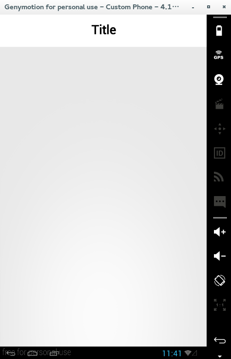  

-------------------------------------------

## 导航栏包含按钮

在导航栏里包含按钮。


__代码片段1__:css  
```
	<style>
	  .ert_bar{left:0px;top:0px;width:320px;height:50px;position:fixed;background-color:#FFFFFF;}
		.ert_btn_label_title{top:10px;width:200px;text-align:center;
			                   font-size:19px;font-weight:bold;color:#000000;}
		.ert_btn{width: 50px;height:30px;font-size:14px;top:10px;}
		.ert_pull_left{left:10px;}
		.ert_pull_right{right:10px;}
	</style>
```
__代码片段2__:页面  
```
  <body name='body'>
	<div class="ert_bar" name="ert_bar" border="0" >
				<input type='button' border="1" class="ert_btn,ert_pull_left" value="Left"></input>
				<label class="ert_btn_label_title">Title</label>
				<input type='button' border="1" class="ert_btn,ert_pull_right" value="Right"></input>
		</div>
		</body>
```
__效果图__:

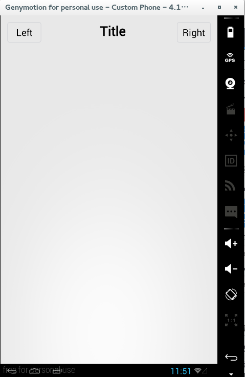  

-------------------------------------------

## 导航栏包含图标

在导航栏里包含图标。


__代码片段1__:css  
```
	<style>
	  .ert_bar{left:0px;top:0px;width:320px;height:50px;position:fixed;background-color:#FFFFFF;}
	  .ert_icon_label_title{top:10px;width:280px;text-align:center;
			                    font-size:19px;font-weight:bold;color:#000000;}
	  .ert_icon{top:10px;width: 20px;height: 30px;}
	  .ert_pull_left{left:10px;}
	  .ert_pull_right{right:10px;}
	</style>
```
__代码片段2__:页面  
```
  <body name='body'>
	<div class="ert_bar" name="ert_bar" border="0">
		 </img>
		 <label class="ert_icon_label_title">Title</label>
		 </img>
	</div>
	</body>
```
__效果图__:

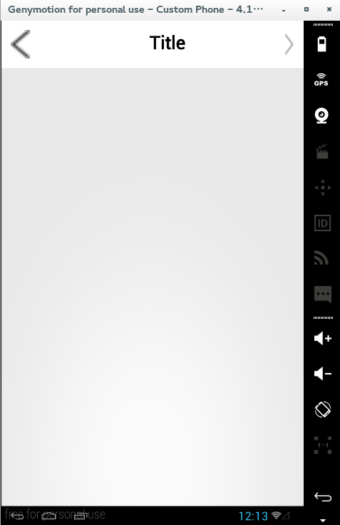

-------------------------------------------

## 导航栏包含文字和图标

在导航栏里包含文字与图标。


__代码片段1__:css  
```
	<style>
	      .ert_bar{left:0px;top:0px;width:320px;height:50px;position:fixed;background-color:#FFFFFF;}
        .ert_label_title_mystyle{top:10px;width: 160px;text-align:center;font-size:19px;font-weight:bold;color:#000000;}
        .ert_btn_mystyle{width: 70px;height:30px;font-size:14px;top:10px;}
        .ert_pull_left{left:10px;}
        .ert_pull_right{right:10px;}
	</style>
```
__代码片段2__:页面  
```
  <body name='body'>
	<div class="ert_bar" name="ert_bar" border="0" >
				<input type='button' border="0" leftImg="btn_back.png" class="ert_btn_mystyle,ert_pull_left" value="Left"></input>
				<label class="ert_label_title_mystyle">Title</label>
				<input type='button' border="0" rightImg="right_arrow.png" class="ert_btn_mystyle,ert_pull_right" value="Right"></input>
		</div>
		</body>
```
__效果图__:

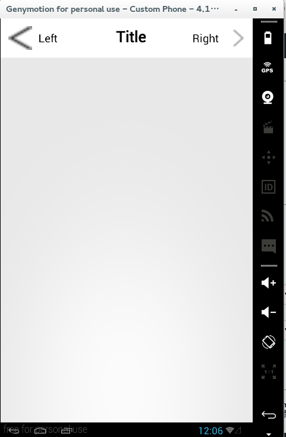  

-------------------------------------------

## 开关

__代码片段1__:css  
```
	<style>
	  .ert_switch_label_title{left:10px;width: 310px;text-align:left;font-size:15px;color:#C0C0C0;}
		.ert_div_switch{width: 320px;height: 50px; background-color: #FFFFFF}
		.ert_switch{top:10px;height: 30px;}

	</style>
```
__代码片段2__:页面  
```
  <body name='body'>

    <label class="ert_switch_label_title">开关:</label>

    <div class="ert_div_switch" align="center">
      <input type="switch" class="ert_switch" name="switch1" value="yes" checked="checked">yes</input>
      <input type="switch" class="ert_switch" name="switch1" value="no">no</input>
    </div>

    <div class="ert_div_switch" align="center">
      <input type="switch" class="ert_switch" name="switch1" value="yes" >yes</input>
      <input type="switch" class="ert_switch" name="switch1" value="no" checked="checked">no</input>
    </div>
  </body>
```
__效果图__:

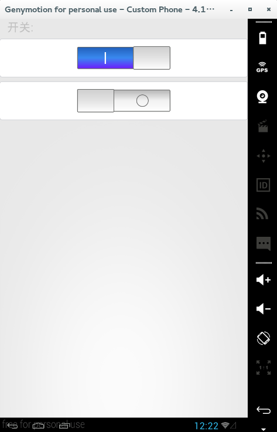  

-------------------------------------------

## 单选框

__代码片段1__:css  
```
	<style>
	    .ert_radio_label_title{left:10px;width: 310px;text-align:left;font-size:15px;color:#C0C0C0;}
			.ert_card{width: 300px;height: 101px;left: 10px;background-color:#FFFFFF;}
			.ert_input_row{left:20px;width: 290px;}
			.ert_radio_height{height:50px;}
			.ert_radio1_top{top:10px;}
			.ert_line{top:50px;height:1px;background-color: #C0C0C0;}
			.ert_radio2_top{top:60px;}
			.ert_radio_left{right: 30px;}
			.ert_radio_right{right: 30px;}

	</style>
```
__代码片段2__:页面  
```
  <body name='body'>
	  <label class="ert_radio_label_title">图标左对齐:</label>
	  <div class="ert_card" border="1">
	    <form  action="" method="post">
	      <div class="ert_input_row,ert_radio_height,ert_radio1_top" border="0">
	         <input type="radio" name="radio1" >Radio</input>
      	</div>
  	    <div class="ert_input_row,ert_line"></div>
      	<div class="ert_input_row,ert_radio_height,ert_radio2_top" border="0">
     	    <input type="radio" name="radio1" checked="checked">Radio</input>
      	</div>
	   </form>
    </div>

		<label class="ert_label_title">图标右对齐:</label>
		<div class="ert_card" border="1">
		  <form  action="" method="post">
        	<div class="ert_input_row,ert_radio_height,ert_radio1_top" border="0">
             <label>Radio</label>
	           <input type="radio" name="radio2" class="ert_radio_right"></input>
	        </div>
        	<div class="ert_input_row,ert_line"></div>
        	<div class="ert_input_row,ert_radio_height,ert_radio2_top" border="0">
	           <label>Radio</label>
             <input type="radio" name="radio2" class="ert_radio_right" checked="checked"></input>
          </div>
     	</form>
	  </div>
  </body>
```
__效果图__:

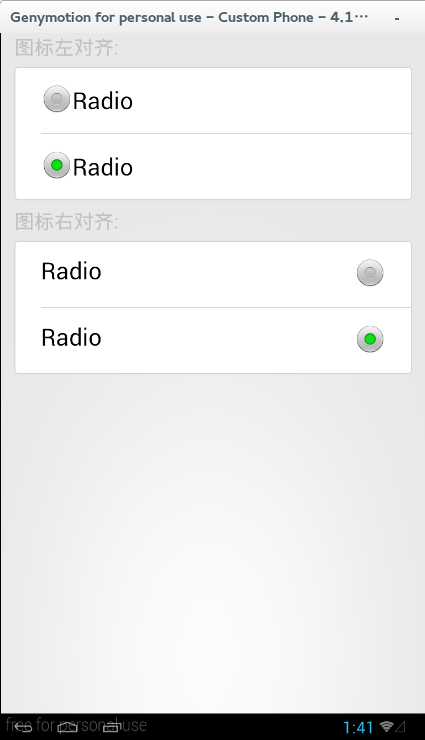  

-------------------------------------------

## 分段选择

__代码片段1__:css  
```
	<style>
	    .ert_div_segmented_control{left:10px;width: 300px;height: 30px;}
			.positionFixed{position:fixed;}
			.ert_segment{width:300px;height: 30px;}
			.ert_content_padded{left:10px;top:35px;width: 300px;height: 150px;background-color: #FFFFFF;}
			.ert_table{left:0px;width:300px;height: 150px}
			.ert_tr{height: 30px}
			.ert_label{left:10px;font-size:15px;}
			.ert_content_padded_display{display:none;}

			.ert_label_title{left:10px;width: 310px;text-align:left;font-size:15px;color:#C0C0C0;}
			.ert_card{width: 300px;left: 10px;background-color:#FFFFFF;}
			.ert_card_height1{height: 91px;}
			.ert_card_height2{height: 137px;}
			.ert_input_row{left:20px;width: 290px;}
			.ert_radio_height{height:45px;}
			.ert_radio1_top{top:10px;}
			.ert_line{height:1px;background-color: #C0C0C0;}
			.ert_line_top1{top:45px;}
			.ert_line_top2{top:91px;}
			.ert_radio2_top{top:55px;}
			.ert_radio3_top{top:102px;}
			.ert_radio_right{right: 30px;}
			.ert_color_label{width: 25px;height: 25px;left:10px;}
			.ert_color1{background-color: 	#0000FF}
			.ert_color2{background-color: 	#00FF00}
			.ert_color3{background-color: 	#FF00FF}
	</style>
```
__代码片段2__:页面  
```
<body>
	<div class="ert_div_segmented_control,positionFixed">
	<input type="segment" name="segment1" class="ert_segment" value="seg1" onclick="onclick()">待办公文(8)</input>
	<input type="segment" name="segment1" value="seg2" onclick="onclick()">已办公文</input>
	<input type="segment" name="segment1" value="seg3" onclick="onclick()">全部公文</input>
	</div>
	<div name="ert_div_segement1" class="ert_content_padded">
	<table class="ert_table" separator="#BDBDBD">
		<tr class="ert_tr">
			<td>
			<label class="ert_label">第一个选项卡子项-1</label>
			</td>
		</tr>
		<tr class="ert_tr">
			<td>
			<label class="ert_label">第一个选项卡子项-2</label>
			</td>
		</tr>
		<tr class="ert_tr">
			<td>
			<label class="ert_label">第一个选项卡子项-3</label>
			</td>
		</tr>
		<tr class="ert_tr">
			<td>
			<label class="ert_label">第一个选项卡子项-4</label>
			</td>
		</tr>
		<tr class="ert_tr">
			<td>
			<label class="ert_label">第一个选项卡子项-5</label>
			</td>
		</tr>
	</table>
	</div>

	<div name="ert_div_segement2"class="ert_content_padded,ert_content_padded_display">
	<table class="ert_table" separator="#BDBDBD">
		<tr class="ert_tr">
			<td>
			<label class="ert_label">第二个选项卡子项-1</label>
			</td>
		</tr>
		<tr class="ert_tr">
			<td>
			<label class="ert_label">第二个选项卡子项-2</label>
			</td>
		</tr>
		<tr class="ert_tr">
			<td>
			<label class="ert_label">第二个选项卡子项-3</label>
			</td>
		</tr>
		<tr class="ert_tr">
			<td>
			<label class="ert_label">第二个选项卡子项-4</label>
			</td>
		</tr>
		<tr class="ert_tr">
			<td>
			<label class="ert_label">第二个选项卡子项-5</label>
			</td>
		</tr>
	</table>
	</div>

	<div name="ert_div_segement3"class="ert_content_padded,ert_content_padded_display">
	<table class="ert_table" separator="#BDBDBD">
		<tr class="ert_tr">
			<td>
			<label class="ert_label">第三个选项卡子项-1</label>
			</td>
		</tr>
		<tr class="ert_tr">
			<td>
			<label class="ert_label">第三个选项卡子项-2</label>
			</td>
		</tr>
		<tr class="ert_tr">
			<td>
			<label class="ert_label">第三个选项卡子项-3</label>
			</td>
		</tr>
		<tr class="ert_tr">
			<td>
			<label class="ert_label">第三个选项卡子项-4</label>
			</td>
		</tr>
		<tr class="ert_tr">
			<td>
			<label class="ert_label">第三个选项卡子项-5</label>
			</td>
		</tr>
	</table>
	</div>

	<label class="ert_label_title">Style:</label>
	<div class="ert_card,ert_card_height1" border="1">
	<form  action="" method="post">
	  <div class="ert_input_row,ert_radio_height,ert_radio1_top" border="0">
	  <label class="ert_label">按钮</label>
  	<input type="radio" name="radio1" class="ert_radio_right" checked="checked"></input>
    </div>
	  <div class="ert_input_row,ert_line,ert_line_top1"></div>
	  <div class="ert_input_row,ert_radio_height,ert_radio2_top" border="0">
	  <label class="ert_label">文字</label>
	  <input type="radio" name="radio1" class="ert_radio_right" ></input>
	</div>
	</form>

	</div>

	<label class="ert_label_title">Color:</label>
	<div class="ert_card,ert_card_height2" border="1">
	<form  action="" method="post">
		<div class="ert_input_row,ert_radio_height,ert_radio1_top" border="0">
		<label class="ert_color_label,ert_color1"></label>
		<input type="radio" name="radio2" class="ert_radio_right" checked="checked"></input>
		</div>
		<div class="ert_input_row,ert_line,ert_line_top1"></div>
		<div class="ert_input_row,ert_radio_height,ert_radio2_top" border="0">
		<label class="ert_color_label,ert_color2"></label>
		<input type="radio" name="radio2" class="ert_radio_right" ></input>
		</div>
		<div class="ert_input_row,ert_line,ert_line_top2"></div>
		<div class="ert_input_row,ert_radio_height,ert_radio3_top" border="0">
		<label class="ert_color_label,ert_color3"></label>
		<input type="radio" name="radio2" class="ert_radio_right" ></input>
		</div>
	</form>
	</div>
	</body>
```
__效果图__:

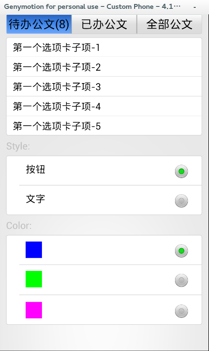  
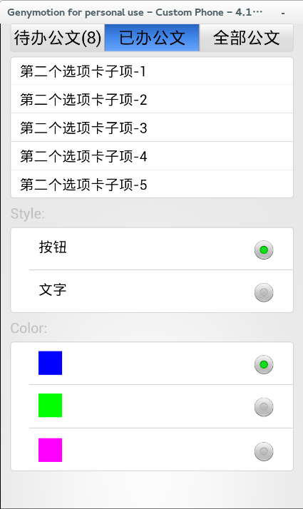
-------------------------------------------

## 可拖动的选项卡

__代码片段1__:css  
```
	<style>
	  .ert_dragCard_table{width: 320px;height: 35;position: fixed;}
		.ert_dragCard_td_size12{height: 35px;width:110px;}
		.ert_dragCard_td_size3{height: 35px;width:100px;}
		.ert_dragCard_label_size12{height: 35px;width:110px;}
		.ert_dragCard_label_size3{height: 35px;width:100px;}
		.ert_dragCard_label_text{text-align:center; font-size: 15px;}
		.ert_dragCard_div{top:35px;height: 3px; background-color: #0000FF;}
		.ert_dragCard_div_width_mystyle{width:110px;left:0px;}


		.ert_label_title{left:10px;width: 310px;text-align:left;font-size:15px;color:#C0C0C0;}
		.ert_card{width: 300px;left: 10px;background-color:#FFFFFF;}
		.ert_card_height2{height: 137px;}
		.ert_input_row{left:20px;width: 290px;}
		.ert_radio_height{height:45px;}
		.ert_radio1_top{top:10px;}
		.ert_line{height:1px;background-color: #C0C0C0;}
		.ert_line_top1{top:45px;}
		.ert_line_top2{top:91px;}
		.ert_radio2_top{top:55px;}
		.ert_radio3_top{top:102px;}
		.ert_radio_right{right: 30px;}
		.ert_color_label{width: 25px;height: 25px;left:10px;}
		.ert_color1{background-color: 	#0000FF}
		.ert_color2{background-color: 	#00FF00}
		.ert_color3{background-color: 	#FF00FF}
	</style>
```
__代码片段2__:页面  
```
<body name='body'>
    <table class="ert_dragCard_table" border="0">
      <tr>
        <td clsss="ert_dragCard_td_size12" onclick="onclick1()">
          <label class="ert_dragCard_label_size12,ert_dragCard_label_text"
                 >待办公文</label>
        </td>
        <td class="ert_dragCard_td_size12" onclick="onclick2()">
          <label class="ert_dragCard_label_size12,ert_dragCard_label_text"
                 >已办公文</label>
        </td>
        <td class="ert_dragCard_td_size3" onclick="onclick3()">
          <label class="ert_dragCard_label_size3,ert_dragCard_label_text"
                 >全部公文</label>
        </td>
      </tr>
    </table>
    <div name="dragCard_div" class="ert_dragCard_div,ert_dragCard_div_width_mystyle">

    </div>

    <label class="ert_label_title">Color:</label>
    <div class="ert_card,ert_card_height2" border="1">
    <form  action="" method="post">
      <div name="div1" class="ert_input_row,ert_radio_height,ert_radio1_top" border="0">
      <label name="label1" class="ert_color_label,ert_color1"></label>
      <input type="radio" name="radio2" class="ert_radio_right" checked="checked"></input>
      </div>
      <div class="ert_input_row,ert_line,ert_line_top1"></div>
      <div name="div2" class="ert_input_row,ert_radio_height,ert_radio2_top" border="0">
      <label name="label2" class="ert_color_label,ert_color2"></label>
      <input type="radio" name="radio2" class="ert_radio_right" ></input>
      </div>
      <div class="ert_input_row,ert_line,ert_line_top2"></div>
      <div name="div3" class="ert_input_row,ert_radio_height,ert_radio3_top" border="0">
      <label name="label3" class="ert_color_label,ert_color3"></label>
      <input type="radio" name="radio2" class="ert_radio_right" ></input>
      </div>
    </form>
    </div>
  </body>
```
__效果图__:

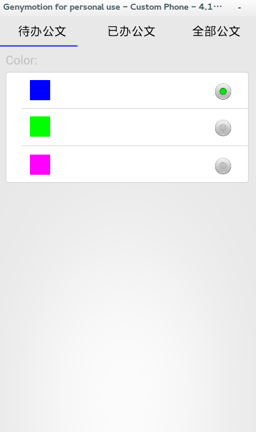  
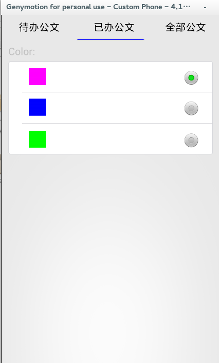
-------------------------------------------

## 选项卡

__代码片段1__:css  
```
	<style>
	    .ert_tab_top_div{top:0px;width: 320px;height: 1px;position: fixed;}
			.ert_tab_bottom_table{width: 320px;height: 60px;position: fixed;}
			.ert_tab_td{width:80px;height: 60px;}
			.ert_tab_label{width: 80px;height: 15px; text-align: center;font-size: 10px; color:#C0C0C0;}
			.ert_tab_div{width: 30px;height: 30px; left:25px;}
			.ert_tab_div_bakimg1{background-image: url(xin_11.png);}
			.ert_tab_div_bakimg2{background-image: url(xin_22.png);}
			.ert_tab_div_bakimg3{background-image: url(xin_33.png);}
			.ert_tab_div_bakimg4{background-image: url(xin_44.png);}

	</style>
```
__代码片段2__:页面  
```
<body name='body'>
    <div class="ert_tab_top_div">

    </div>

    <table class="ert_tab_bottom_table" border="1">
      <tr>
        <td class="ert_tab_td" onclick="onclick1()">
          <div name="div1"class="ert_tab_div,ert_tab_div_bakimg1" border="0"></div>
          <label name="label1" class="ert_tab_label">电话咨询</label>
        </td>
        <td class="ert_tab_td" onclick="onclick2()">
          <div name="div2" class="ert_tab_div,ert_tab_div_bakimg2" border="0"></div>
          <label name="label2" class="ert_tab_label">在线咨询</label>
        </td>
        <td class="ert_tab_td" onclick="onclick3()">
          <div name="div3" class="ert_tab_div,ert_tab_div_bakimg3" border="0"></div>
          <label name="label3" class="ert_tab_label">短信咨询</label>
        </td>
        <td class="ert_tab_td" onclick="onclick4()">
          <div name="div4" class="ert_tab_div,ert_tab_div_bakimg4" border="0"></div>
          <label name="label4" class="ert_tab_label">查看地图</label>
        </td>
      </tr>
    </table>
 </body>
```
__效果图__:

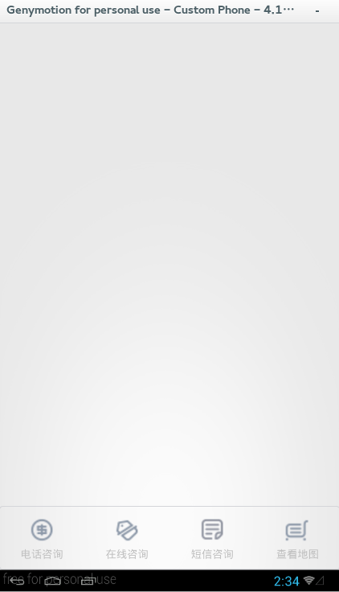  
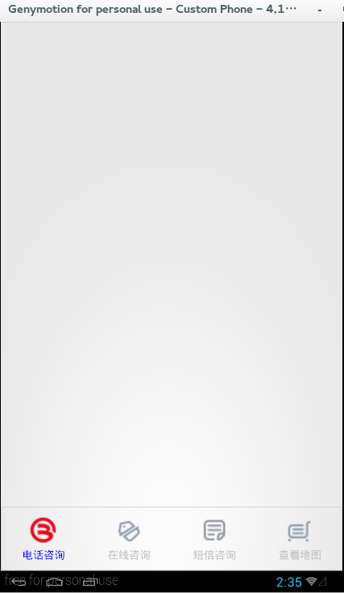
-------------------------------------------
