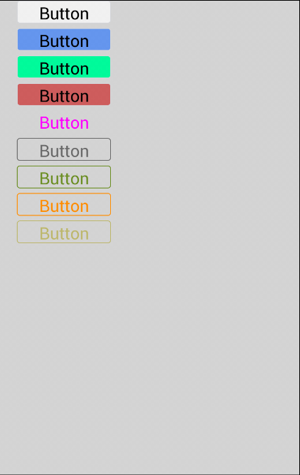
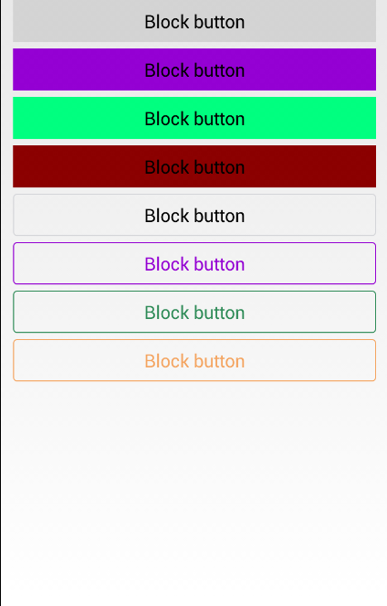
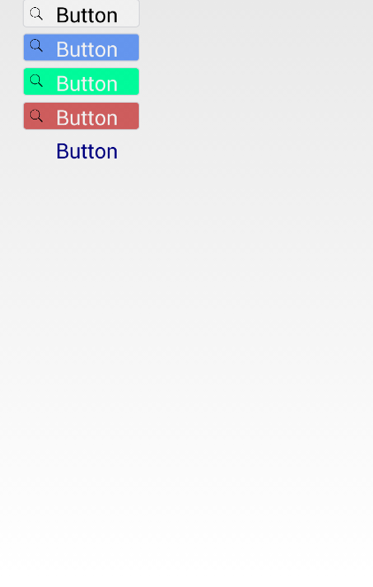
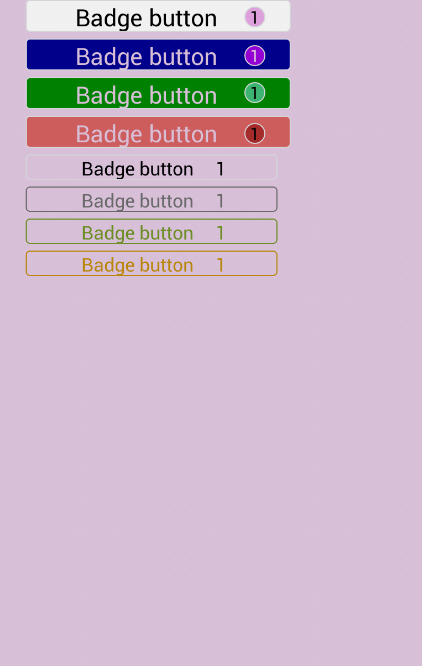
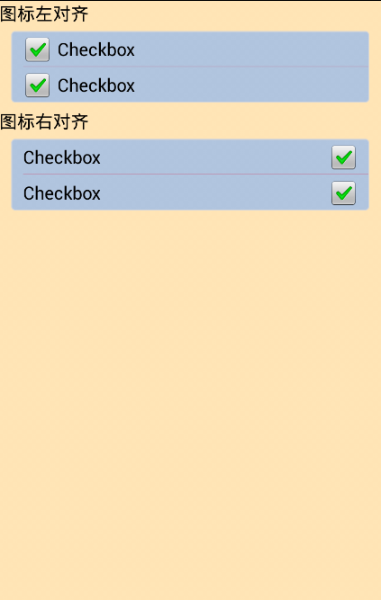

# ERT基础控件库

## button

CSS代码片段：
```
            .body {background-color:#D3D3D3;}
            .title{width:320px;top:30px;text-align:center;font-size:25px;}
            .ert_btn1{left:20px; width:100px; background-color: #f0f0f0;}
            .ert_btn2{left:20px; width:100px; background-color: #6495ED;}
            .ert_btn3{left:20px; width:100px; background-color: #00FA9A;}
            .ert_btn4{left:20px; width:100px; background-color: #CD5C5C;}
            .ert_btn5{left:20px; width:100px; font color: #FF00FF;}
            .ert_btn6{left:20px; width:100px; border: #696969;font color:#696969;}
            .ert_btn7{left:20px; width:100px; border: #6B8E23;font color:#6B8E23;}
            .ert_btn8{left:20px; width:100px; border: #FF8C00;font color:#FF8C00;}
            .ert_btn9{left:20px; width:100px; border: #BDB76B;font color:#BDB76B;}
```
页面报文代码片段

```
        <input type='button' value='Button' border='1' class='ert_btn1'></input>
        <input type='button' value='Button' border='1' class='ert_btn2'></input>
        <input type='button' value='Button' border='1' class='ert_btn3'></input>
        <input type='button' value='Button' border='1' class='ert_btn4'></input>
        <input type='button' value='Button' class='ert_btn5'></input>
        <input type='button' value='Button' border='1' class='ert_btn6'></input>
        <input type='button' value='Button' border='1' class='ert_btn7'></input>
        <input type='button' value='Button' border='1' class='ert_btn8'></input>
        <input type='button' value='Button' border='1' class='ert_btn9'></input>

```
效果图


##　块状button

CSS代码片段：
```
            .ert_btn1 {width:300px;height:35px;left:10px;font-size:15px;background-color:#D3D3D3;display:block}
            .ert_btn2 {width:300px;height:35px;left:10px;font-size:15px;background-color:#9400D3;display:block}
            .ert_btn3 {width:300px;height:35px;left:10px;font-size:15px;background-color:#00FF7F;display:block}
            .ert_btn4 {width:300px;height:35px;left:10px;font-size:15px;background-color:#8B0000;display:block}
            .ert_btn5 {width:300px;height:35px;left:10px;font-size:15px;display:block}
            .ert_btn6 {width:300px;height:35px;left:10px;font-size:15px;font color:#9400D3; border:#9400D3;display:block}
            .ert_btn7 {width:300px;height:35px;left:10px;font-size:15px;font color:#2E8B57; border:#2E8B57;display:block}
            .ert_btn8 {width:300px;height:35px;left:10px;font-size:15px;font color:#F4A460; border:#F4A460;display:block}
```
页面报文代码片段

```
        <input type='button' value='Block button' class='ert_btn1'></input>
        <input type='button' value='Block button' class='ert_btn2'></input>
        <input type='button' value='Block button' class='ert_btn3'></input>
        <input type='button' value='Block button' class='ert_btn4'></input>
        <input type='button' value='Block button' class='ert_btn5'border='1'></input>
        <input type='button' value='Block button' class='ert_btn6'border='1'></input>
        <input type='button' value='Block button' class='ert_btn7'border='1'></input>
        <input type='button' value='Block button' class='ert_btn8'border='1'></input>

```
效果图



## 带图标的button

CSS代码片段：
```
        .father{width:15px;height:15px;left:10px;}
        .ert_btn1{left:20px; width:100px; background-color: #f0f0f0;}
        .ert_btn2{left:20px; width:100px; background-color: #6495ED;font color:#f0f0f0;}
        .ert_btn3{left:20px; width:100px; background-color: #00FA9A;font color:#f0f0f0;}
        .ert_btn4{left:20px; width:100px; background-color: #CD5C5C;font color:#f0f0f0;}
        .ert_btn5{left:20px; width:100px; font color: #000080;}
        .ert_dvo{left:24px;top:5px;}
        .ert_dvt{left:24px;top:32px;}
        .ert_dvs{left:24px;top:62px;}
        .ert_dvf{left:24px;top:92px;}
```
页面报文代码片段

```
      <input type='button' value="  Button" border='1' class='ert_btn1'></input>
        </img>
      <input type='button' value='  Button' border='1' class='ert_btn2'></input>
        </img>
      <input type='button' value='  Button' border='1' class='ert_btn3'></input>
        </img>
      <input type='button' value='  Button' border='1' class='ert_btn4'></input>
        </img>
      <input type='button' value='  Button' class='ert_btn5'></input>
```
效果图



## 带数字的按钮
CSS代码片段：
```
        .body{background-color:#D8BFD8;}
        .ert_btn1{left:20px; width:200px; background-color: #f0f0f0;}
        .ert_btn2{left:20px; width:200px; color:#D8BFD8;background-color: #00008B;}
        .ert_btn3{left:20px; width:200px; color:#D8BFD8;background-color: #008000;}
        .ert_btn4{left:20px; width:200px; color:#D8BFD8;background-color: #CD5C5C;}
        .ert_btn5{left:20px; width:190px; font color: #000000;font-size:14px;}
        .ert_btn6{left:20px; width:190px; border: #696969;font color:#696969;font-size:14px;}
        .ert_btn7{left:20px; width:190px; border: #6B8E23;font color:#6B8E23;font-size:14px;}
        .ert_btn8{left:20px; width:190px; border: #B8860B;font color:#B8860B;font-size:14px;}
        .ert_div1{left:185px; top:5px;width:16px; height:16px; border-radius:8px;background-color:#DDA0DD;}
        .ert_div2{left:185px; top:34px;width:16px; height:16px; border-radius:8px;background-color:#9400D3;}
        .ert_div3{left:185px; top:62px;width:16px; height:16px; border-radius:8px;background-color:#3CB371;}
        .ert_div4{left:185px; top:93px;width:16px; height:16px; border-radius:8px;background-color:#A52A2A;}
        .ert_1{font-size:13px;}
        .ert_21{font color:#D8BFD8;}
```
页面报文代码片段

```
        <input type='button' value='Badge button    ' border='1' class='ert_btn1'></input>
          <div align="center" valign="middle" class='ert_div1'>
            <label class='ert_1'>1</label>
          </div>
        <input type='button' value='Badge button    ' border='1' class='ert_btn2'></input>
          <div align="center" valign="middle" class='ert_div2'>
            <label class='ert_1,ert_21'>1</label>
          </div>
        <input type='button' value='Badge button    ' border='1' class='ert_btn3'></input>
            <div align="center" valign="middle" class='ert_div3'>
              <label class='ert_1'>1</label>
            </div>
        <input type='button' value='Badge button    ' border='1' class='ert_btn4'></input>
                <div align="center" valign="middle" class='ert_div4'>
                  <label class='ert_1'>1</label>
                </div>
        <input type='button' value=' Badge button     1' border='1' class='ert_btn5'></input>
        <input type='button' value=' Badge button     1' border='1' class='ert_btn6'></input>
        <input type='button' value=' Badge button     1' border='1' class='ert_btn7'></input>
        <input type='button' value=' Badge button     1' border='1' class='ert_btn8'></input>

```
效果图



# Checkbox

## 复选框
CSS代码片段：
```
        .body {background-color:#FFE4B5;}
        .ert_div {left:10px;right:10px;background-color: #B0C4DE;}
        .ert_tab {left:10px;width:300px;}
        .ert_label {font-size: 15px}
        .ert_checkbox {width: 150px;font-size: 15px;}
        .ert_right{right:20px;}
```
页面报文代码片段

```
      <label class='ert_label'>图标左对齐</label>
        <div class='ert_div'>
          <table border='0' separator="#DC143C" class='ert_tab'>
            <tr>
              <td ><input type="checkbox" class='ert_checkbox'>Checkbox</input></td>
            </tr>
            <tr>
              <td><input type="checkbox" class='ert_checkbox'>Checkbox</input></td>
            </tr>
          </table>
        </div>
      <label class='ert_label'>图标右对齐</label>
        <div class='ert_div'>
          <table border='0' separator="#DC143C" class='ert_tab'>
            <tr>
              <td><label class='ert_label'>Checkbox</label></td>
              <td><input type="checkbox" class='ert_right'></input></td>
            </tr>
            <tr>
              <td><label class='ert_label'>Checkbox</label></td>
              <td><input type="checkbox" class='ert_right'></input></td>
            </tr>
          </table>
        </div>
```
效果图




